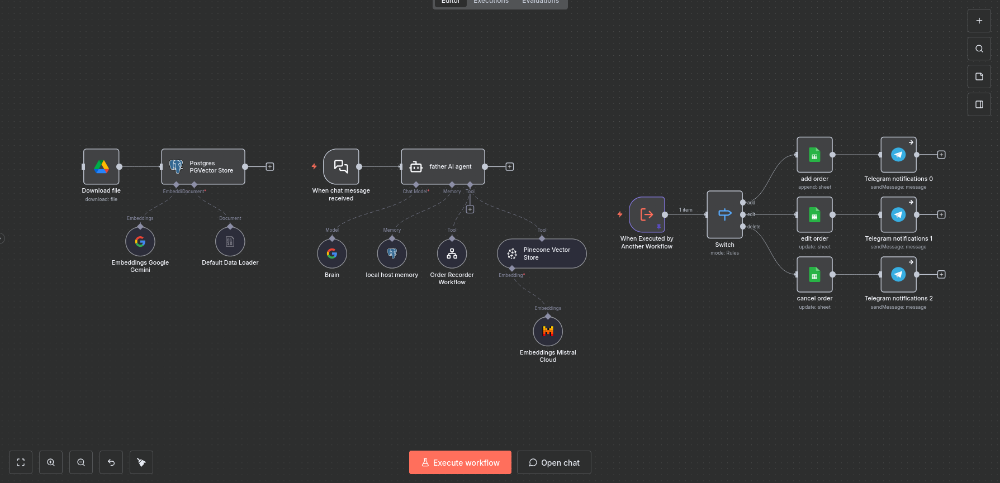

# AI Customer Service & Order Management Workflow

## Overview

This workflow implements an AI-powered customer service system for an online store.
It combines conversational AI, knowledge retrieval, and automated order management within a single automated pipeline.

Customers can interact with the system through chat to ask questions about products and services or to create, modify, or cancel orders.
The AI agent handles the conversation, collects the required information, and triggers the appropriate order-processing workflow.

---

## Key Features

* AI-powered customer support agent
* Automated order creation, editing, and cancellation
* Integration with a knowledge base using vector search
* Conversation memory for contextual interactions
* Order storage using Google Sheets
* Real-time order notifications via Telegram

---

## Workflow Architecture

### 1. Chat Trigger

The workflow starts when a user sends a message through the chat interface.
The message is received and passed to the AI agent.

---

### 2. AI Customer Service Agent

The main AI agent acts as a customer support assistant.
Its responsibilities include:

* Answering customer questions
* Providing product or service information
* Collecting order details
* Triggering order actions

The agent uses strict behavioral rules to ensure it only performs supported tasks.

---

### 3. Knowledge Retrieval

If a customer asks for information about products or services, the agent can search the store's internal knowledge base using a vector database.

The workflow uses:

* Pinecone vector search
* Embedding models for semantic retrieval

This allows the AI to answer questions using the most relevant stored information.

---

### 4. Conversation Memory

Customer conversations are stored in a PostgreSQL-based memory system.
This allows the AI to maintain context across multiple messages.

---

### 5. Order Processing Tool

When a customer wants to place, modify, or cancel an order, the AI agent calls a dedicated workflow tool responsible for order management.

The tool receives structured data including:

* Client ID
* Client Name
* Phone Number
* Order Details
* Action Type

---

### 6. Order Action Routing

A switch node routes the request based on the requested action:

* **Add** → Create a new order
* **Edit** → Update an existing order
* **Cancel** → Remove or cancel an order

---

### 7. Order Storage

Orders are stored and managed inside a Google Sheets document.

Each record includes:

* Client ID
* Client name
* Phone number
* Order details
* Action status

---

### 8. Admin Notifications

After each order action, the workflow sends a notification to the store administrator via Telegram.

Notifications include:

* Customer name
* Phone number
* Order details
* Client ID

This allows the store owner to monitor all incoming order activity.

---

## Technologies Used

* n8n (automation platform)
* Google Gemini (language model)
* Pinecone (vector database)
* PostgreSQL (chat memory)
* Google Sheets (order database)
* Telegram Bot API (notifications)

---

## Setup

1. Import the `workflow.json` file into your n8n instance.
2. Configure the required credentials:

   * Google Sheets
   * Google Drive
   * Pinecone
   * Telegram Bot
   * PostgreSQL
   * Google Gemini API
3. Update the spreadsheet and database identifiers as needed.
4. Activate the workflow.

---

## Example Use Cases

This workflow can be adapted for:

* AI-powered customer service systems
* Automated order management
* Online store chat assistants
* Knowledge-base-driven support bots

---

## Notes

This workflow demonstrates how conversational AI can be integrated with automation tools to build a scalable and intelligent customer support system.
