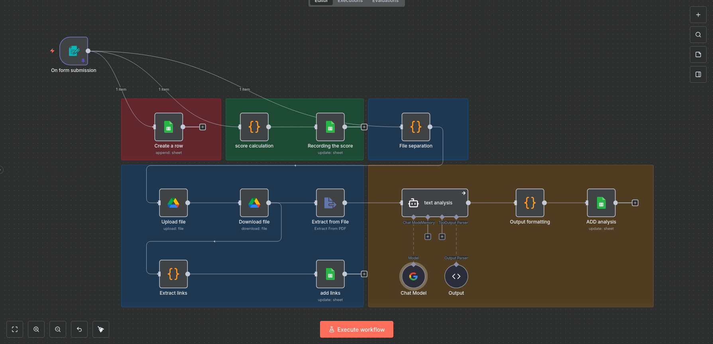

# AI Form Processing & PDF Analysis Workflow

## Overview

This workflow built with **n8n** automates the processing of form submissions that include survey answers and uploaded PDF files.
It stores user responses, uploads files, extracts text from PDFs, performs AI-based analysis, and records all results in Google Sheets.

The workflow demonstrates how automation can combine **form handling, file storage, AI analysis, and data logging** in a single pipeline.

---

## Use Case

This automation can be used for:

* Collecting structured responses from users
* Receiving uploaded documents
* Automatically analyzing uploaded PDFs
* Scoring questionnaire responses
* Storing structured results in a spreadsheet

Example scenario:

A student submits a form with personal information, answers to questions, and one or more PDF documents (e.g., book reviews).
The system automatically processes the files and extracts useful information.

---

## Workflow Architecture

The workflow consists of several logical stages:

### 1. Form Submission

The workflow starts with an **n8n Form Trigger** that collects:

* Name
* Email address
* Questionnaire answers
* Uploaded PDF files

---

### 2. Store Form Data

User responses are immediately recorded in **Google Sheets** to ensure data is stored even if later steps fail.

---

### 3. Score Calculation

A custom **Code Node** calculates a score based on the answers.

Example scoring logic:

| Question    | Answer          | Score |
| ----------- | --------------- | ----- |
| How are you | good            | 10    |
| How are you | its okey        | 5     |
| How are you | not good        | 0     |
| Whay?       | i don't know    | 0     |
| Whay?       | i have a reason | 5     |

The calculated score is then written back to the spreadsheet.

---

### 4. File Processing Pipeline

Uploaded files go through several steps:

1. **File Separation**

   * Splits multiple uploaded files into individual items.

2. **Upload to Google Drive**

   * Each file is stored in a dedicated Google Drive folder.

3. **Download File**

   * Retrieves the uploaded file to continue processing.

4. **Extract Links**

   * Generates shareable links to the uploaded files.

These links are then saved in Google Sheets.

---

### 5. PDF Text Extraction

The **Extract from File** node extracts text content from the uploaded PDFs.

This text is then passed to an AI model for analysis.

---

### 6. AI Document Analysis

The extracted text is processed using **Google Gemini** through n8n's AI nodes.

The AI agent performs structured analysis to extract:

* Book title
* Author name
* Short summary (50–60 words)

The output is structured using an output parser.

---

### 7. Structured Result Formatting

Results from multiple analyzed files are combined into a single structured output.

---

### 8. Store AI Results

The final extracted information is written back into **Google Sheets**, including:

* File links
* Book titles
* Authors
* Generated summaries

---

## Technologies Used

This workflow integrates multiple services:

* **n8n** automation platform
* **Google Drive** for file storage
* **Google Sheets** for structured data logging
* **Google Gemini AI** for text analysis
* **JavaScript Code Nodes** for custom logic

---

## Setup Instructions

### 1. Import Workflow

Import the `workflow.json` file into your n8n instance.

---

### 2. Configure Credentials

You must connect the following credentials:

* Google Drive
* Google Sheets
* Google Gemini API

---

### 3. Update Resource IDs

Replace the following values with your own resources:

* Google Drive folder ID
* Google Sheets document ID
* Sheet name

---

### 4. Activate Workflow

Enable the workflow after configuration.

---

## Example Output

After a submission, the spreadsheet will contain:

| Name | Email | Score | File Link | Book Title | Author | Summary |
| ---- | ----- | ----- | --------- | ---------- | ------ | ------- |

All steps occur automatically after the form is submitted.

---

## Key Features

* Automated form processing
* Multi-file upload handling
* Automated PDF text extraction
* AI-powered document analysis
* Automatic scoring system
* Fully automated spreadsheet logging

---

## Requirements

* Self-hosted or cloud **n8n**
* Google account with Drive and Sheets access
* Google Gemini API access

---

## Notes

* This workflow assumes uploaded documents contain book reviews.
* The AI analysis step may require prompt tuning depending on document structure.
* File processing supports multiple uploaded PDFs per submission.

---

## License

This workflow is shared for educational and automation demonstration purposes.
